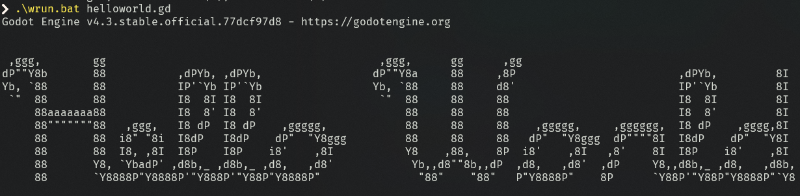

# Using GDscript in Terminal

> [!NOTE]
> Set path of your Godot in run or wrun
> ```godot_path```
> example: *C:/tools/Godot4.3/godot.exe*

## Command for execute
```shell
godot --headless --script myscript.gd

# or using debug

godot --headless --script myscript.gd --verbose
```

# Preview
